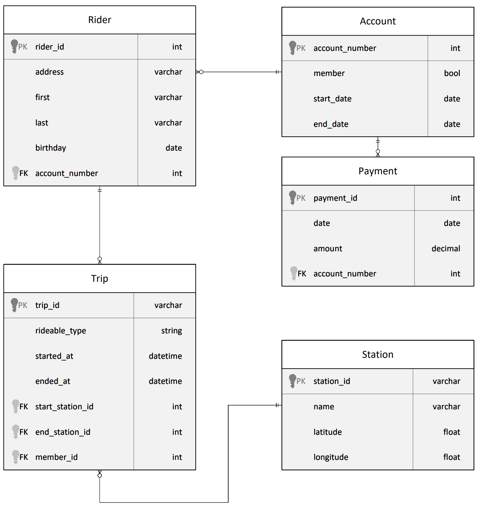
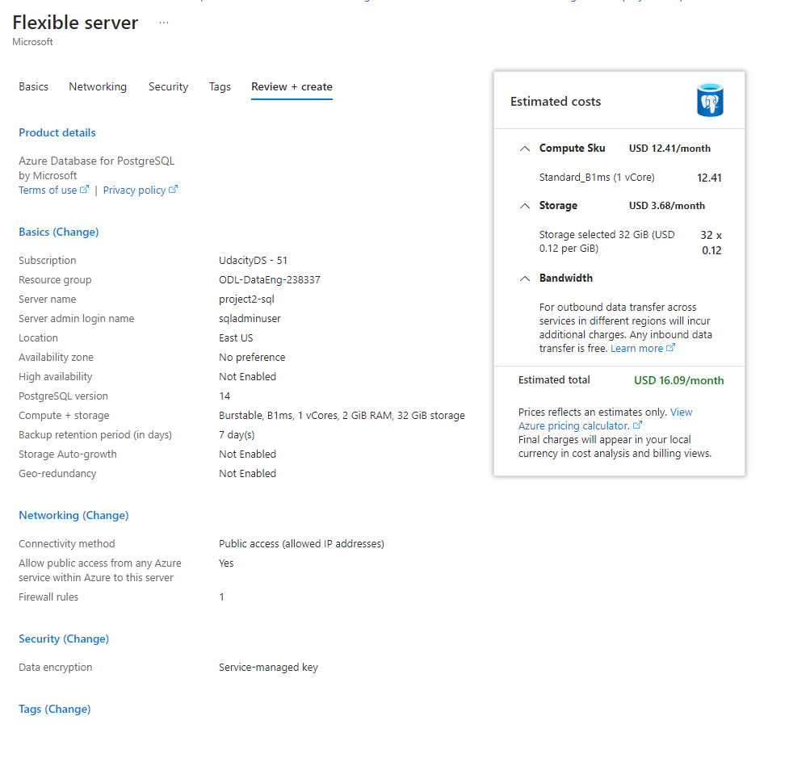
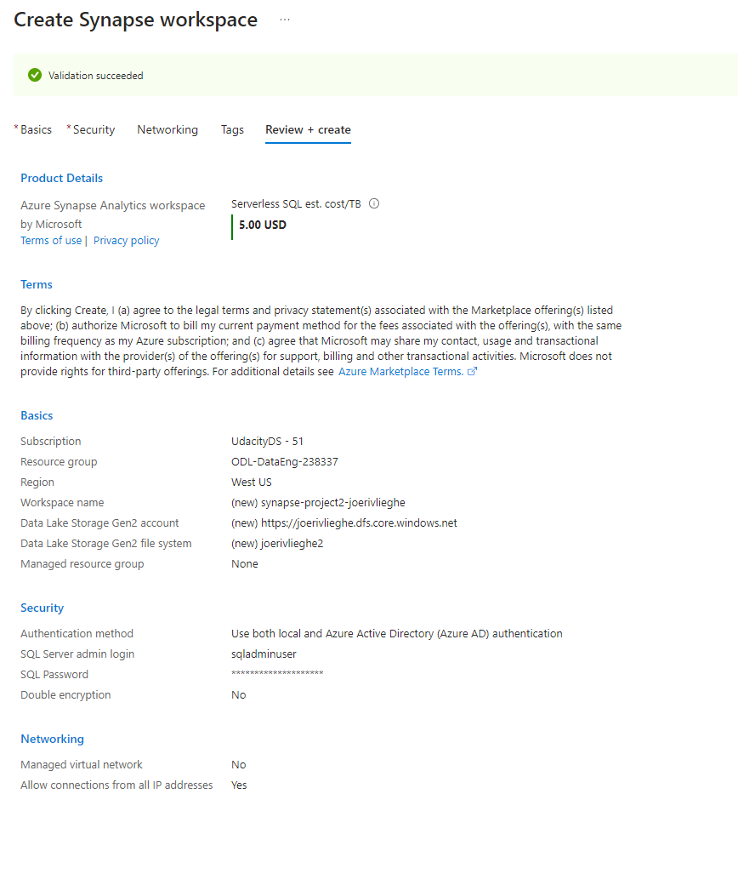
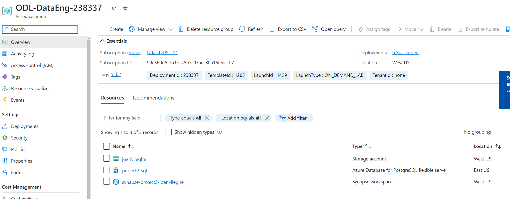
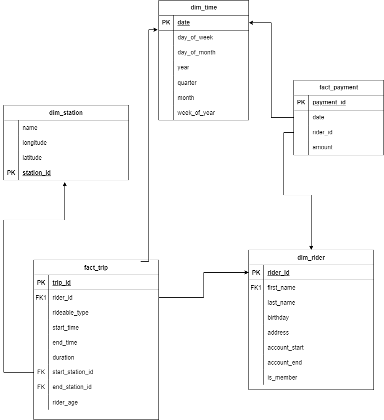
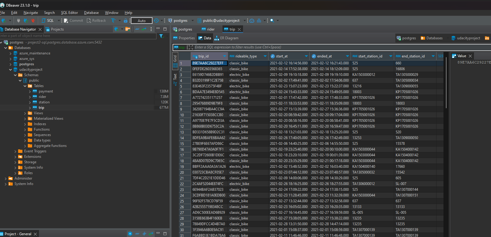
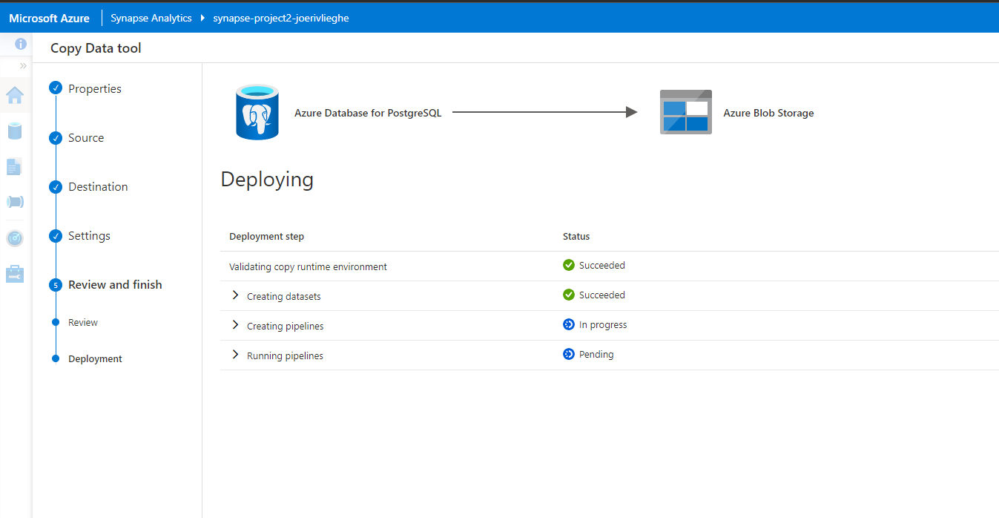
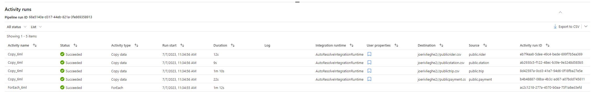
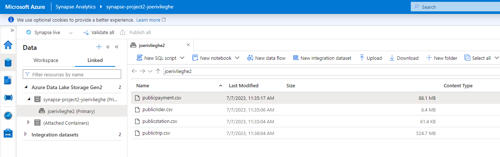
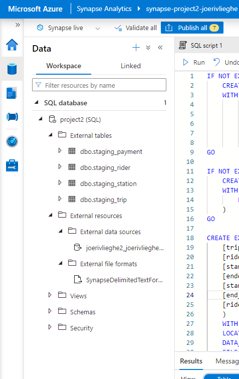

# azure-project2 - Divvy Bikeshare Azure Data Warehouse
# Joeri Vlieghe

# Project Overview

Divvy is a bike sharing program in Chicago, Illinois USA that allows riders to purchase a pass at a kiosk or use a mobile application to unlock a bike at stations around the city and use the bike for a specified amount of time. The bikes can be returned to the same station or to another station. The City of Chicago makes the anonymized bike trip data publicly available for projects like this where we can analyze the data.

Since the data from Divvy are anonymous, we have created fake rider and account profiles along with fake payment data to go along with the data from Divvy. The dataset looks like this:

This image represents the data model for the dataset based on the Divvy Bikeshare data. The tables include: Rider, Account, Payment, Trip, and Station.
Relational ERD for the Divvy Bikeshare Dataset (with fake data tables)

The goal of this project is to develop a data warehouse solution using Azure Synapse Analytics. You will:

### Design a star schema based on the business outcomes listed below;
- Import the data into Synapse;
- Transform the data into the star schema;
- and finally, view the reports from Analytics.

### The business outcomes you are designing for are as follows:
- Analyze how much time is spent per ride
- Based on date and time factors such as day of week and time of day
- Based on which station is the starting and / or ending station
- Based on age of the rider at time of the ride
 -Based on whether the rider is a member or a casual rider
### Analyze how much money is spent
- Per month, quarter, year
- Per member, based on the age of the rider at account start

# Tasks needed for this project

### Task 1: Create your Azure resources
- Create an Azure Database for PostgreSQL.

- Create an Azure Synapse workspace. Note that if you've previously created a Synapse Workspace, you do not need to create a second one specifically for the project.
- Use the built-in serverless SQL pool and database within the Synapse workspace

Screenshot of the resource group with all created resources

### Task 2: Design a star schema

You are being provided a relational schema that describes the data as it exists in PostgreSQL. In addition, you have been given a set of business requirements related to the data warehouse. You are being asked to design a star schema using fact and dimension tables.

### Task 3: Create the data in PostgreSQL

Data was loaded into the Azure SQL database using the provided python script (ProjectDataToPostgreSQL.py)

I used DBeaver to explore the data and see if is correctly loaded:

### Task 4: EXTRACT the data from PostgreSQL

In your Azure Synapse workspace, you will use the ingest wizard to create a one-time pipeline that ingests the data from PostgreSQL into Azure Blob Storage. This will result in all four tables being represented as text files in Blob Storage, ready for loading into the data warehouse.

In the following screenshot you can see the pipeline ingest task that was created. I have chosen to ingest all 4 tables at once and create 4 files.

In Synapse Data tab we can see the 4 files that were created:

### Task 5: LOAD the data into external tables in the data warehouse

Started creating the staging_payment table. As per instructions used the following data types, but got errors. The reason was that the external file format I created initially was not using the first column as headers. I changed this the 2nd time I created the sql script but it did not overwrite the initally created file format. I had to add another sql script to drop the file format first.

After doing this all 4 tables were loaded in correctly. The 4 SQL scripts for this are found in the /load_external folder.

All external tables loaded in the built-in serverless SQL:

### Task 6: TRANSFORM the data to the star schema using CETAS

Write SQL scripts to transform the data from the staging tables to the final star schema you designed.

Scripts are in /transform folder.

Got stuck on creating the date dimension table -- did not find a way to create this using an external table on serverless. Spent 2+ hours on researching this, then the session timed out. The session time-out is really not a student-friendly approach to this. Also, if you expect students to work in serverless environment the material should be adapted to reflect this.

For the dim_date I kept encountering the error "External table dim_date is not accessible because location does not exist or it is used by another process". The work in progress is stored in the dim_date.sql and dim_date2.sql scripts.

